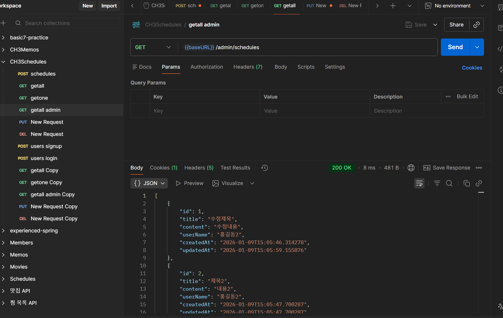
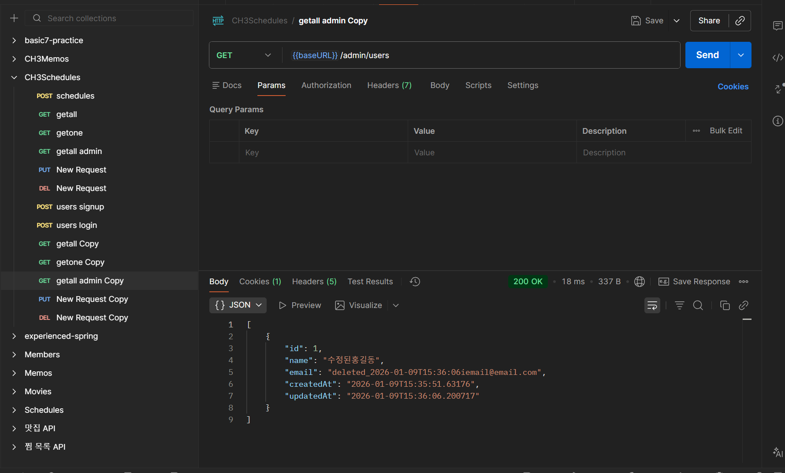
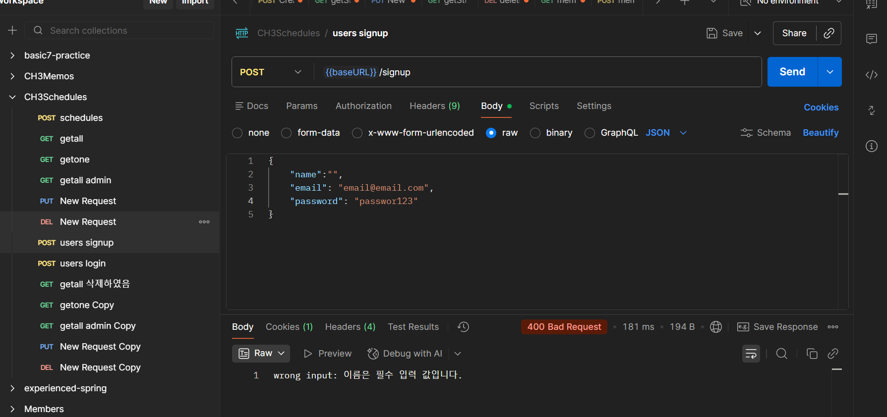
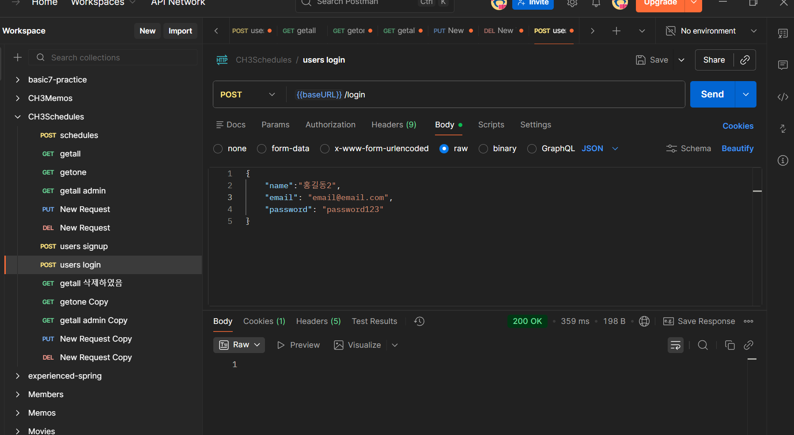
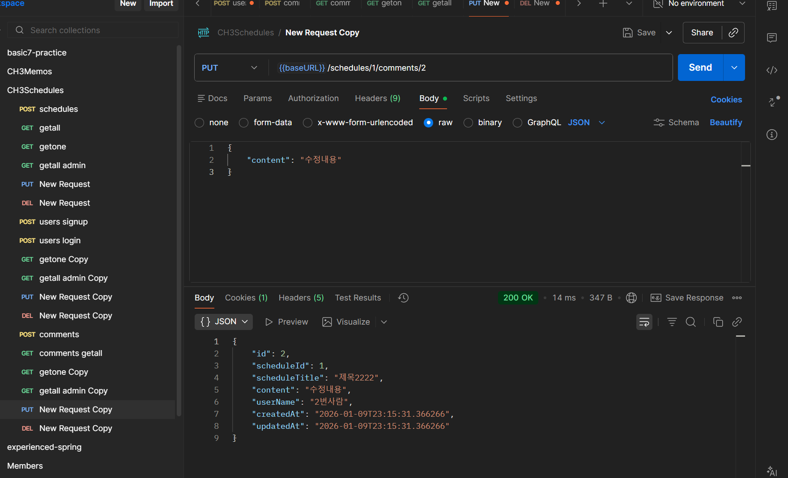
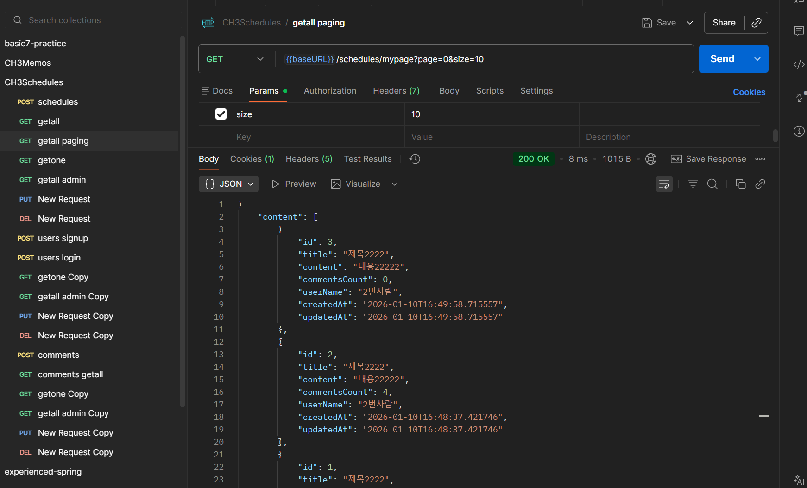
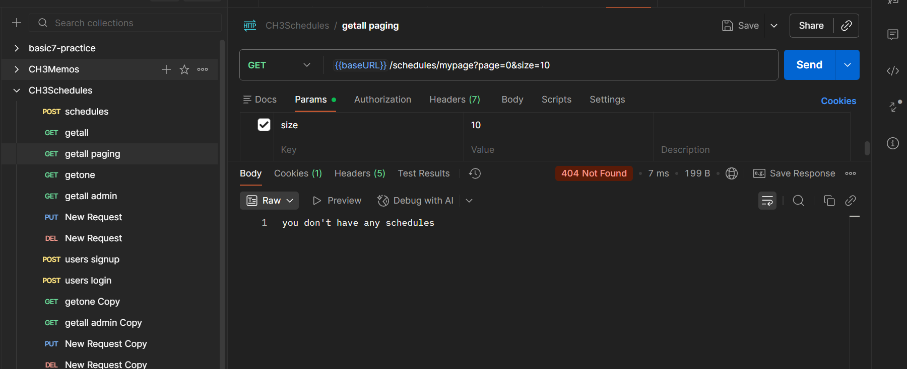

# Spring 일정 관리 앱 develop 과제

- 삭제의 경우 soft delete 로 구현하였음
- 유효하다: deleted == false


## 로그인 정책 관련
- 유저 생성: signup url 변경
- 유저 로그인: 추가
- 유저 조회 all: 논리상 부자연스러우므로 삭제, 관리자에서 조회 all 하도록 함
- 유저 조회 one: 현재 로그인한 사용자의 정보 출력
- 유저 수정: 로그인한 사용자인지 확인
- 유저 삭제: url 변경 /admin/users/1
- 유저 관리자조회 all: 그대로


- 일정 생성: 그대로
- 일정 조회 all: 로그인한 유저의 유효한 일정 전체
- 일정 조회 one: 로그인한 유저의 유효한 일정인지 확인
- 일정 수정: 로그인한 유저의 유효한 일정인지 확인
- 일정 삭제: 로그인한 유저의 유효한 일정인지 확인
- 일정 관리자조회 all: 그대로
- 일정 조회 all 페이징: 로그인한 유저의 유효한 일정 전체


- 댓글 생성: 로그인한 유저의 유효한 일정인지 확인
- 댓글 조회 all: 로그인한 유저의 유효한 일정의 유효한 댓글
- 댓글 조회 one: 로그인한 유저의 유효한 일정의 유효한 댓글
- 댓글 수정: 로그인한 유저의 유효한 일정의 유효한 댓글
- 댓글 삭제: 로그인한 유저의 유효한 일정의 유효한 댓글
- 댓글 관리자조회 all: -

## 조회 규칙
- 로그인 해야만 CRUD 가능
- 자신의 것만 보임(일정, 댓글)
- soft delete된 엔티티(일정, 댓글) 안보임
- 관리자 조회는 아무 조건 없이 전부 조회

=================================================================


## API 명세서

|       기능       | method |                      url                      |        request        |           response           | 상태코드 |
|:--------------:|:------:|:---------------------------------------------:|:---------------------:|:----------------------------:|:----:|
|     일정 생성      |  POST  |                  /schedules                   | ScheduleCreateRequest |    ScheduleCreateResponse    | 201  |
|   일정 조회 all    |  GET   |                  /schedules                   |           -           |  List<ScheduleGetResponse>   | 200  |
|   일정 조회 one    |  GET   |            /schedules/{scheduleId}            |      scheduleId       |     ScheduleGetResponse      | 200  |
|     일정 수정      |  PUT   |            /schedules/{scheduleId}            | ScheduleUpdateRequest |    ScheduleUpdateResponse    | 200  |
|     일정 삭제      | DELETE |            /schedules/{scheduleId}            |      scheduleId       |                              | 204  |
|     유저 생성      |  POST  |                    /signup                    |   UserSignUpRequest   |      UserSignUpResponse      | 201  |
| 유저 조회 all - 삭제 |  GET   |                    /users                     |           -           |    List<UserGetResponse>     | 200  |
|   유저 조회 one    |  GET   |                    /users                     |        userId         |       UserGetResponse        | 200  |
|     유저 수정      |  PUT   |                    /users                     |   UserUpdateRequest   |      UserUpdateResponse      | 200  |
|     유저 삭제      | DELETE |             /admin/users/{userId}             |        userId         |              -               | 204  |
|  일정 관리자조회 all  |  GET   |               /admin/schedules                |           -           |  List<ScheduleGetResponse>   | 200  |
|  유저 관리자조회 all  |  GET   |                 /admin/users                  |           -           |    List<UserGetResponse>     | 200  |
|     유저 로그인     |  POST  |                    /login                     |   UserLoginRequest    |              -               | 200  |
|     댓글 생성      |  POST  |       /schedules/{scheduleId}/comments        | CommentCreateRequest  |    CommentCreateResponse     | 201  |
|   댓글 조회 all    |  GET   |       /schedules/{scheduleId}/comments        |           -           |   List<CommentGetResponse>   | 200  |
|   댓글 조회 one    |  GET   | /schedules/{scheduleId}/comments/{commentsId} |       commentId       |      CommentGetResponse      | 200  |
|     댓글 수정      |  PUT   | /schedules/{scheduleId}/comments/{commentsId} | CommentUpdateRequest  |    CommentUpdateResponse     | 200  |
|     댓글 삭제      | DELETE | /schedules/{scheduleId}/comments/{commentsId} |       commentId       |                              | 204  |
|  댓글 관리자조회 all  |  GET   |                /admin/comments                |           -           |   List<CommentGetResponse>   | 200  |
| 일정 조회 all 페이징  |  GET   |   /schedules/mypage?page={page}&size={size}   |           -           | List<CommentGetPageResponse> | 200  |


ScheduleCreateRequest -- json

```json
{
    "title": "제목",
    "content": "내용"
}
```

ScheduleCreateResponse -- json

```json
{
    "id": 1,
    "userName":"홍길동",
    "title": "제목",
    "content": "내용", 
    "createdAt": "2026-01-08T14:58:49.459596",
    "modifiedAt": "2026-01-08T14:58:49.459596"
}
```

ScheduleGetPageResponse -- json

```json

{
    "content": [
        {
            "id": 3,
            "title": "제목2222",
            "content": "내용22222",
            "commentsCount": 0,
            "userName": "2번사람",
            "createdAt": "2026-01-10T16:49:58.715557",
            "updatedAt": "2026-01-10T16:49:58.715557"
        },
        {
            "id": 2,
            "title": "제목2222",
            "content": "내용22222",
            "commentsCount": 4,
            "userName": "2번사람",
            "createdAt": "2026-01-10T16:48:37.421746",
            "updatedAt": "2026-01-10T16:48:37.421746"
        },
        {
            "id": 1,
            "title": "제목2222",
            "content": "내용22222",
            "commentsCount": 7,
            "userName": "2번사람",
            "createdAt": "2026-01-10T16:48:34.314566",
            "updatedAt": "2026-01-10T16:48:34.314566"
        }
    ],
    "empty": false,
    "first": true,
    "last": true,
    "number": 0,
    "numberOfElements": 3,
    "pageable": {
        "offset": 0,
        "pageNumber": 0,
        "pageSize": 10,
        "paged": true,
        "sort": {
            "empty": false,
            "sorted": true,
            "unsorted": false
        },
        "unpaged": false
    },
    "size": 10,
    "sort": {
        "empty": false,
        "sorted": true,
        "unsorted": false
    },
    "totalElements": 3,
    "totalPages": 1
}
```


ScheduleGetResponse-- json

```json
{
    "id": 1,
    "title":"제목제목",
    "content": "내용내용",
    "userName": "홍길동",
    "createdAt": "~",
    "modifiedAt": "~"
}
```


```json
[
  {
    "id": 1,
    "title": "제목",
    "content": "내용",
    "userName": "홍길동",
    "createdAt": "2026-01-08T14:58:49.459596",
    "updatedAt": "2026-01-08T14:58:49.459596"
  },
  {
    "id": 2,
    "title": "제목2",
    "content": "내용2",
    "userName": "홍길동2",
    "createdAt": "2026-01-08T15:13:55.920403",
    "updatedAt": "2026-01-08T15:13:55.920403"
  }
]
```

ScheduleUpdateRequest -- json

```json
{
    "title": "수정제목",
    "content": "수정내용"
}
```


ScheduleUpdateResponse -- json

```json
{
    "id": 1,
    "userName":"홍길동",
    "title": "수정제목",
    "content": "수정내용",
    "createdAt": "2026-01-08T15:13:55.920403",
    "updatedAt": "2026-01-08T15:13:55.920403"
}
```

UserSignUpRequest -- json

```json
{
    "name":"홍길동",
    "email": "email@email.com",
    "password": "password"
}
```

UserSignUpResponse -- json

```json
{
    "id": 1,
    "name":"홍길동",
    "email": "email@email.com",
    "createdAt": "~",
    "modifiedAt": "~"
}
```

UserLoginRequest -- json

```json
{
    "name":"홍길동",
    "email": "email@email.com",
    "password": "password123"
}
```

UserGetResponse-- json

```json
{
    "id": 1,
    "name":"홍길동",
    "email": "email@email.com",
    "createdAt": "~",
    "modifiedAt": "~"
}
```

```json
[
    {
    "id": 1,
    "title": "제목2",
    "content": "내용2",
    "userName": "홍길동",
    "createdAt": "2026-01-08T17:52:58.908226",
    "updatedAt": "2026-01-08T17:52:58.908226"
    },
    {
    "id": 2,
    "title": "제목2",
    "content": "내용2",
    "userName": "홍길동",
    "createdAt": "2026-01-08T17:53:03.024096",
    "updatedAt": "2026-01-08T17:53:03.024096"
    }
]

```

UserUpdateRequest-- json

```json
{
    "name":"수정된홍길동",
    "email": "iemail@email.com"
}
```

UserUpdateResponse-- json

```json
{
    "id": 1,
    "name":"수정된홍길동",
    "email": "iemail@email.com",
    "createdAt": "~",
    "modifiedAt": "~"
}
```

CommentCreateRequest -- json

```json
{
    "content": "내용내용"
}
```

CommentCreateResponse -- json

```json
{
    "id": 1,
    "scheduleId": 1,
    "content": "내용", 
    "createdAt": "2026-01-08T14:58:49.459596",
    "modifiedAt": "2026-01-08T14:58:49.459596"
}
```


CommentGetResponse-- json

```json
{
    "id": 1,
    "scheduleId": 1,
    "scheduleTitle": "일정제목",
    "content": "내용내용",
    "userName": "홍길동",
    "createdAt": "~",
    "modifiedAt": "~"
}
```


```json
[
  {
    "id": 1,
    "scheduleId": 1,
    "scheduleTitle": "일정제목",
    "content": "내용내용",
    "userName": "홍길동",
    "createdAt": "2026-01-08T14:58:49.459596",
    "updatedAt": "2026-01-08T14:58:49.459596"
  },
  {
    "id": 2,
    "scheduleId": 1,
    "scheduleTitle": "일정제목",
    "content": "내용내용",
    "userName": "홍길동",
    "createdAt": "2026-01-08T15:13:55.920403",
    "updatedAt": "2026-01-08T15:13:55.920403"
  }
]
```

CommentUpdateRequest -- json

```json
{
    "content": "수정내용"
}
```


CommentUpdateResponse -- json

```json
{
    "id": 2,
    "scheduleId": 1,
    "scheduleTitle": "일정제목",
    "content": "내용내용",
    "userName": "홍길동",
    "createdAt": "2026-01-08T15:13:55.920403",
    "updatedAt": "2026-01-08T15:13:55.920403"
}
```

=================================================================

## ERD


```

Table schedule {
  id integer [primary key]
  user_id integer [not null]
  title varchar [not null]
  content varchar [not null]
  created_at timestamp [not null]
  modified_at timestamp [not null]
  deleted boolean
}

Table user {
  id integer [primary key]
  name varchar [not null]
  email varchar [not null]
  created_at timestamp [not null]
  modified_at timestamp [not null]
  deleted boolean
}

Table comment {
  id integer [primary key]
  content varchar [not null]
  created_at timestamp [not null]
  modified_at timestamp [not null]
  user_id integer [not null]
  schedule_id integer [not null]
  deleted boolean
}

Ref user_schedule: schedule.user_id > user.id // many-to-one
Ref user_comment: comment.user_id > user.id // many-to-one
Ref schedule_comment: comment.schedule_id > schedule.id // many-to-one

```

```sql
CREATE TABLE user (

    id BIGINT PRIMARY KEY AUTO_INCREMENT,

    name VARCHAR(255) NOT NULL,

    email VARCHAR(255) NOT NULL,

    createdAt TIMESTAMP NOT NULL,

    modifiedAt TIMESTAMP NOT NULL,
    
    deleted boolean NOT NULL DEFAULT false

);

CREATE TABLE schedule (

    id BIGINT PRIMARY KEY AUTO_INCREMENT,

    user_id BIGINT NOT NULL,

    title VARCHAR(255) NOT NULL,

    content VARCHAR(255) NOT NULL,

    createdAt TIMESTAMP NOT NULL,

    modifiedAt TIMESTAMP NOT NULL,

    deleted boolean NOT NULL DEFAULT false,

    CONSTRAINT fk_schedule_user

    FOREIGN KEY (user_id)

    REFERENCES user(id)


)

CREATE TABLE comment
(
    id          BIGINT PRIMARY KEY AUTO_INCREMENT,
    content     VARCHAR(255) NOT NULL,
    createdAt   TIMESTAMP    NOT NULL,
    modifiedAt  TIMESTAMP    NOT NULL,
    user_id     BIGINT       NOT NULL,
    schedule_id BIGINT       NOT NULL,
    deleted     boolean      NOT NULL DEFAULT false,
    CONSTRAINT fk_comment_user FOREIGN KEY (user_id) REFERENCES user (id),
    CONSTRAINT fk_comment_schedule FOREIGN KEY (schedule_id) REFERENCES schedule (id)
)
```


## 포스트맨 과정 캡쳐

- schedule 두 개를 생성하였다.


- schedule 1번을 삭제


- admin 에서는 다 보이고, 그냥 조회할 때는 삭제한 것은 안 보인다.


- user 도 마찬가지로 진행했다. 두개 생성


- user 1번을 삭제


- admin에서는 다 보인다. 


- 수정도 잘 된다.


- 유저가 삭제된 경우 조회하면 userName이 탈퇴한 사용자라고 보인다.


- 세션을 적용하여 JSessionID 가 보이는 것을 확인하였다.


- 로그인 기능을 적용한 후 기능들이 정상 동작하는 것을 확인하였다.
  (일부만 캡쳐)
 
- 


- 예외처리 후 기능들이 정상 동작하는 것을 확인하였다.(유저 생성 및 로그인부터 RUD -> 스케줄 CRUD)
아래 캡쳐화면은 수정 및 삭제 후 admin 조회 결과이다.


- 유저의 삭제 정책이 잘 반영되었는지 확인하였다(이메일 중복 문제). 


- 전역 예외처리 후 잘 되는지 확인하였다.


- 비밀번호 암호화 후 로그인이 잘 되는지 확인하였다. 
이름이 달라도 로그인 되긴 하는데 로그인 조건이 이메일과 패스워드이므로 수정하지 않았다.
- 

- 댓글 생성 후 테스트하여 작동 확인하였다.



- 일정 페이징 했을 때 잘 나오는지 확인하였다. 댓글이 0개일 때도 잘 처리되었고, 작성한 일정이 없을 때는 일정이 없다고 출력된다. 

