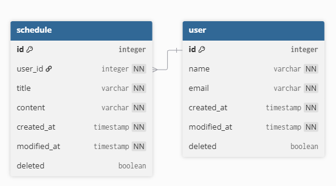
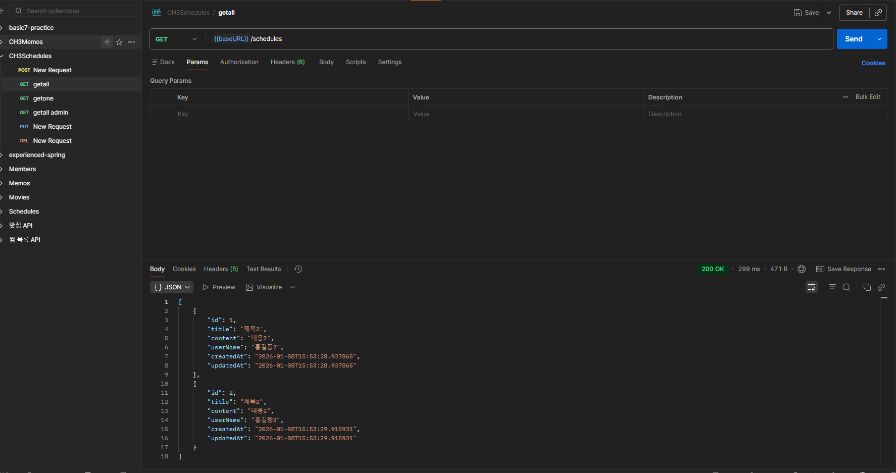
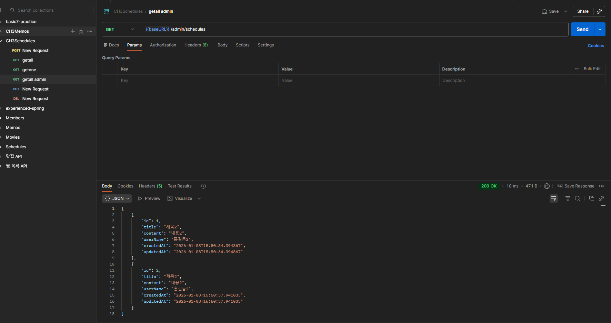
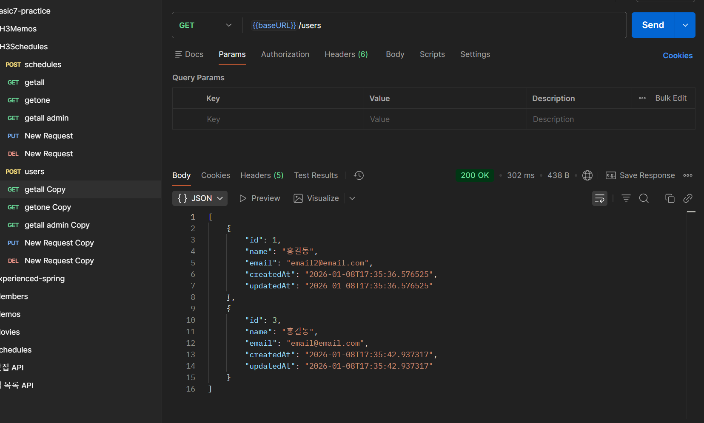
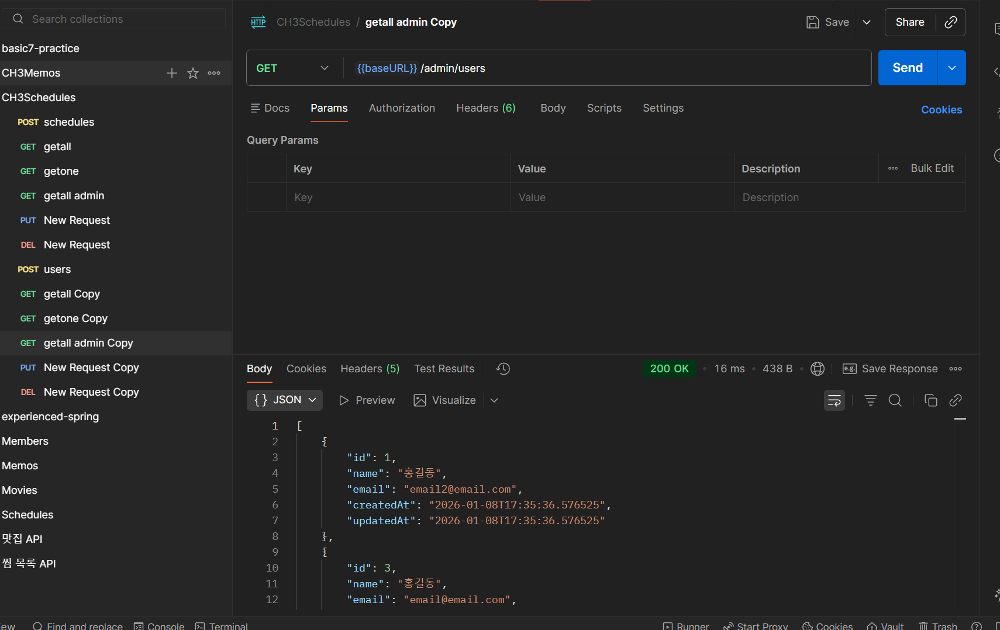
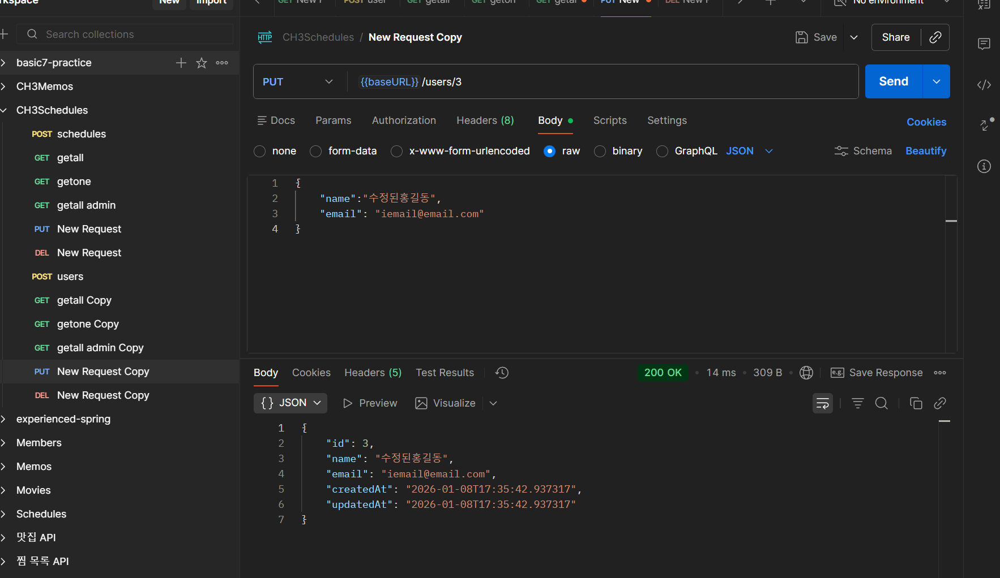

# Spring 일정 관리 앱 develop 과제

- 삭제의 경우 soft delete 로 구현하였음

=================================================================


## API 명세서

|      기능      | method |           url           |        request        |         response          | 상태코드 |
|:------------------:|:------:|:-----------------------:|:---------------------:|:-------------------------:|:----:|
|    일정 생성     |  POST  |       /schedules        | ScheduleCreateRequest |  ScheduleCreateResponse   | 201  |
|  일정 조회 all   |  GET   |       /schedules        |           -           | List<ScheduleGetResponse> | 200  |
|  일정 조회 one   |  GET   | /schedules/{scheduleId} |      scheduleId       |    ScheduleGetResponse    | 200  |
|    일정 수정     |  PUT   | /schedules/{scheduleId} | ScheduleUpdateRequest |  ScheduleUpdateResponse   | 200  |
|    일정 삭제     | DELETE | /schedules/{scheduleId} |      scheduleId       |                           | 204  |
|    유저 생성     |  POST  |         /users          |   UserCreateRequest   |    UserCreateResponse     | 201  |
|  유저 조회 all   |  GET   |         /users          |           -           |   List<UserGetResponse>   | 200  |
|  유저 조회 one   |  GET   |     /users/{userId}     |        userId         |      UserGetResponse      | 200  |
|    유저 수정     |  PUT   |     /users/{userId}     |   UserUpdateRequest   |    UserUpdateResponse     | 200  |
|    유저 삭제     | DELETE |     /users/{userId}     |        userId         |             -             | 204  |
| 일정 관리자조회 all |  GET   |     admin/schedules     |           -           | List<ScheduleGetResponse> | 200  |
| 유저 관리자조회 all |  GET   |       admin/users       |           -           |   List<UserGetResponse>   | 200  |

ScheduleCreateRequest -- json

```json
{
    "userId":"1",
    "title": "제목",
    "content": "내용"
}
```

ScheduleCreateResponse -- json

```json
{
    "id": "1",
    "userName":"홍길동",
    "title": "제목",
    "content": "내용", 
    "createdAt": "2026-01-08T14:58:49.459596",
    "modifiedAt": "2026-01-08T14:58:49.459596"
}
```

ScheduleGetResponse-- json

```json
{
    "id": "1",
    "title":"제목제목",
    "content": "내용내용",
    "userName": "홍길동",
    "createdAt": "~",
    "modifiedAt": "~"
}
```


```json
[
  {
    "id": 1,
    "title": "제목",
    "content": "내용",
    "userName": "홍길동",
    "createdAt": "2026-01-08T14:58:49.459596",
    "updatedAt": "2026-01-08T14:58:49.459596"
  },
  {
    "id": 2,
    "title": "제목2",
    "content": "내용2",
    "userName": "홍길동2",
    "createdAt": "2026-01-08T15:13:55.920403",
    "updatedAt": "2026-01-08T15:13:55.920403"
  }
]
```

ScheduleUpdateRequest -- json

```json
{
    "title": "수정제목",
    "content": "수정내용"
}
```


ScheduleUpdateResponse -- json

```json
{
    "id": "1",
    "userName":"홍길동",
    "title": "수정제목",
    "content": "수정내용",
    "createdAt": "2026-01-08T15:13:55.920403",
    "updatedAt": "2026-01-08T15:13:55.920403"
}
```

UserCreateRequest -- json

```json
{
    "name":"홍길동",
    "email": "email@email.com"
}
```

UserCreateResponse -- json

```json
{
    "id": "1",
    "name":"홍길동",
    "email": "email@email.com",
    "createdAt": "~",
    "modifiedAt": "~"
}
```

UserGetResponse-- json

```json
{
    "id": "1",
    "name":"홍길동",
    "email": "email@email.com",
    "createdAt": "~",
    "modifiedAt": "~"
}
```

//추후 여러개 버전 추가

UserUpdateRequest-- json

```json
{
    "name":"수정된홍길동",
    "email": "iemail@email.com"
}
```

UserUpdateResponse-- json

```json
{
    "id": "1",
    "name":"수정된홍길동",
    "email": "iemail@email.com",
    "createdAt": "~",
    "modifiedAt": "~"
}
```

=================================================================

## ERD


```sql
CREATE TABLE user (

    id BIGINT PRIMARY KEY AUTO_INCREMENT,

    name VARCHAR(255) NOT NULL,

    email VARCHAR(255) NOT NULL,

    createdAt TIMESTAMP NOT NULL,

    modifiedAt TIMESTAMP NOT NULL,
    
    deleted boolean NOT NULL DEFAULT false

);

CREATE TABLE schedule (

    id BIGINT PRIMARY KEY AUTO_INCREMENT,

    user_id BIGINT NOT NULL,

    title VARCHAR(255) NOT NULL,

    content VARCHAR(255) NOT NULL,

    createdAt TIMESTAMP NOT NULL,

    modifiedAt TIMESTAMP NOT NULL,

    deleted boolean NOT NULL DEFAULT false,

    CONSTRAINT fk_schedule_user

    FOREIGN KEY (user_id)

    REFERENCES user(id)


)
```


## 포스트맨 캡쳐

- schedule 두 개를 생성하였다.



- schedule 1번을 삭제


- admin 에서는 다 보이고, 그냥 조회할 때는 삭제한 것은 안 보인다.



- user 도 마찬가지로 진행했다. 두개 생성



- user 1번을 삭제


- admin에서는 다 보인다. 


- 수정도 잘 된다.


- 유저가 삭제된 경우 조회하면 userName이 탈퇴한 사용자라고 보인다.
