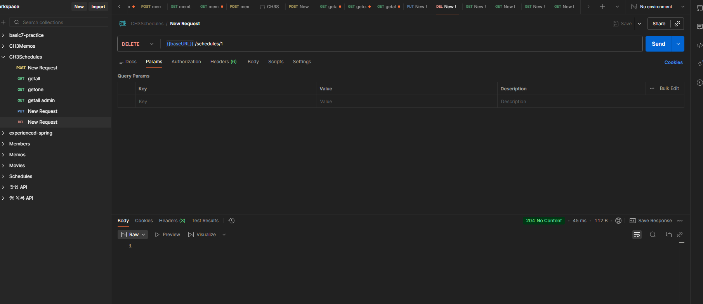
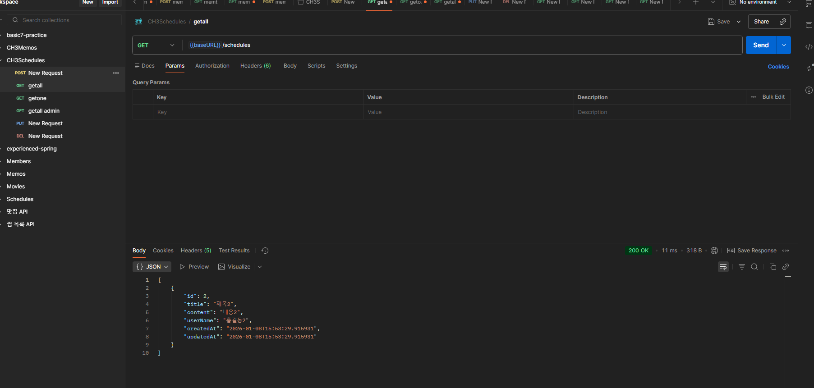
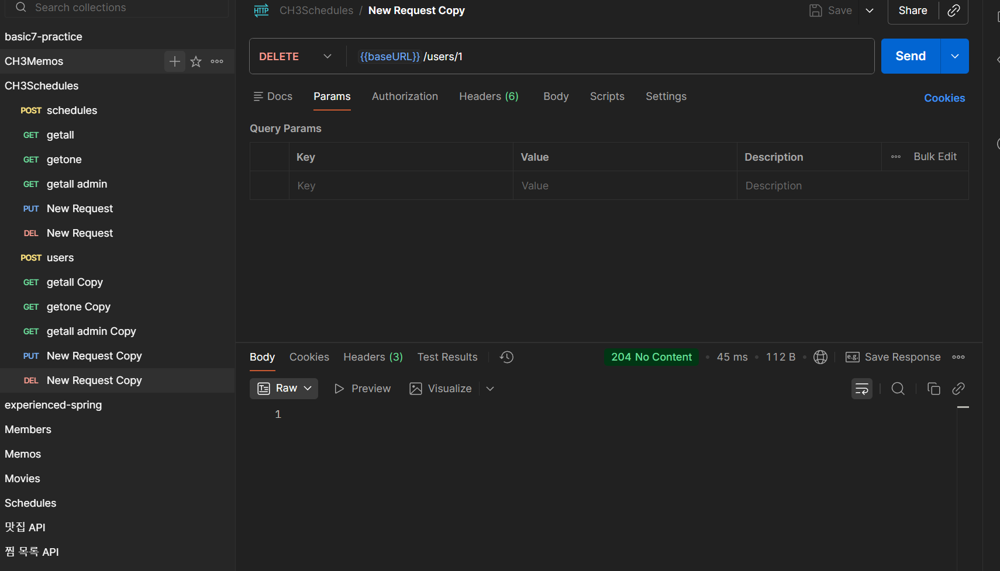
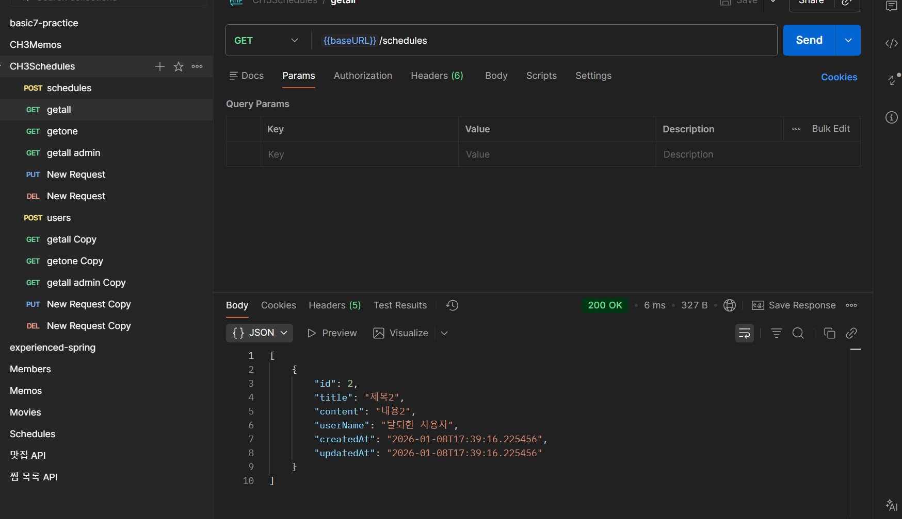
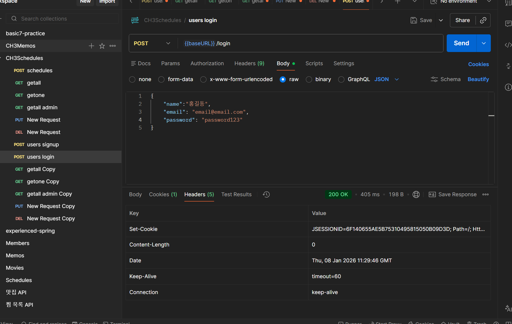
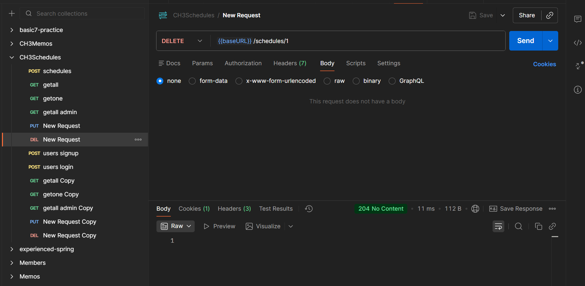
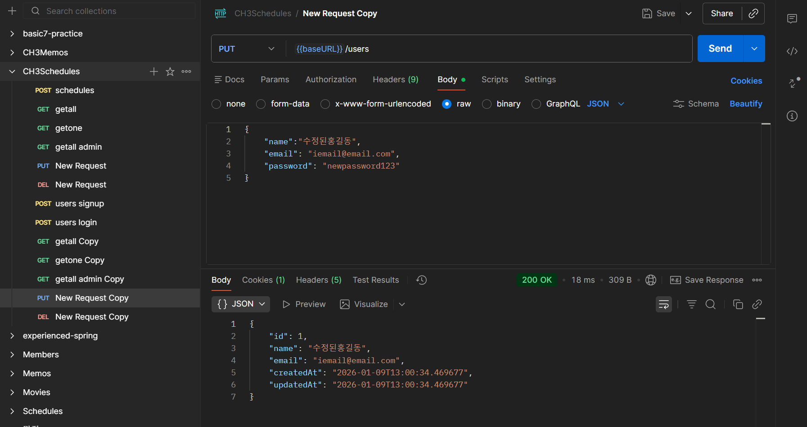

# Spring 일정 관리 앱 develop 과제

- 삭제의 경우 soft delete 로 구현하였음


## 로그인 정책이 생긴 이후
- 유저 생성: signup url 변경
- 유저 로그인: 추가
- 유저 조회 all: 논리상 부자연스러우므로 삭제, 관리자에서 조회 all 하도록 함
- 유저 조회 one: 현재 로그인한 사용자의 정보 출력
- 유저 수정: 로그인한 사용자인지 확인 절차 추가
- 유저 삭제: url 변경 /admin/users/1


- 일정 생성: 그대로
- 일정 조회 all: 로그인한 유저의 일정 전체
- 일정 조회 one: 로그인한 유저의 일정인지 확인 절차 추가
- 일정 수정: 로그인한 유저의 일정인지 확인 절차 추가
- 일정 삭제: 로그인한 유저의 일정인지 확인 절차 추가

=================================================================


## API 명세서

|       기능       | method |           url           |        request        |         response          | 상태코드 |
|:--------------:|:------:|:-----------------------:|:---------------------:|:-------------------------:|:----:|
|     일정 생성      |  POST  |       /schedules        | ScheduleCreateRequest |  ScheduleCreateResponse   | 201  |
|   일정 조회 all    |  GET   |       /schedules        |           -           | List<ScheduleGetResponse> | 200  |
|   일정 조회 one    |  GET   | /schedules/{scheduleId} |      scheduleId       |    ScheduleGetResponse    | 200  |
|     일정 수정      |  PUT   | /schedules/{scheduleId} | ScheduleUpdateRequest |  ScheduleUpdateResponse   | 200  |
|     일정 삭제      | DELETE | /schedules/{scheduleId} |      scheduleId       |                           | 204  |
|     유저 생성      |  POST  |         /signup         |   UserSignUpRequest   |    UserSignUpResponse     | 201  |
| 유저 조회 all - 삭제 |  GET   |         /users          |           -           |   List<UserGetResponse>   | 200  |
|   유저 조회 one    |  GET   |         /users          |        userId         |      UserGetResponse      | 200  |
|     유저 수정      |  PUT   |         /users          |   UserUpdateRequest   |    UserUpdateResponse     | 200  |
|     유저 삭제      | DELETE |  /admin/users/{userId}  |        userId         |             -             | 204  |
|  일정 관리자조회 all  |  GET   |    /admin/schedules     |           -           | List<ScheduleGetResponse> | 200  |
|  유저 관리자조회 all  |  GET   |      /admin/users       |           -           |   List<UserGetResponse>   | 200  |
|     유저 로그인     |  POST  |         /login          |   UserLoginRequest    |             -             | 200  |


ScheduleCreateRequest -- json

```json
{
    "userId":"1",
    "title": "제목",
    "content": "내용"
}
```

ScheduleCreateResponse -- json

```json
{
    "id": "1",
    "userName":"홍길동",
    "title": "제목",
    "content": "내용", 
    "createdAt": "2026-01-08T14:58:49.459596",
    "modifiedAt": "2026-01-08T14:58:49.459596"
}
```

ScheduleGetResponse-- json

```json
{
    "id": "1",
    "title":"제목제목",
    "content": "내용내용",
    "userName": "홍길동",
    "createdAt": "~",
    "modifiedAt": "~"
}
```


```json
[
  {
    "id": 1,
    "title": "제목",
    "content": "내용",
    "userName": "홍길동",
    "createdAt": "2026-01-08T14:58:49.459596",
    "updatedAt": "2026-01-08T14:58:49.459596"
  },
  {
    "id": 2,
    "title": "제목2",
    "content": "내용2",
    "userName": "홍길동2",
    "createdAt": "2026-01-08T15:13:55.920403",
    "updatedAt": "2026-01-08T15:13:55.920403"
  }
]
```

ScheduleUpdateRequest -- json

```json
{
    "title": "수정제목",
    "content": "수정내용"
}
```


ScheduleUpdateResponse -- json

```json
{
    "id": "1",
    "userName":"홍길동",
    "title": "수정제목",
    "content": "수정내용",
    "createdAt": "2026-01-08T15:13:55.920403",
    "updatedAt": "2026-01-08T15:13:55.920403"
}
```

UserSignUpRequest -- json

```json
{
    "name":"홍길동",
    "email": "email@email.com",
    "password": "password"
}
```

UserSignUpResponse -- json

```json
{
    "id": "1",
    "name":"홍길동",
    "email": "email@email.com",
    "createdAt": "~",
    "modifiedAt": "~"
}
```

UserLoginRequest -- json

```json
{
    "name":"홍길동",
    "email": "email@email.com",
    "password": "password123"
}
```

UserGetResponse-- json

```json
{
    "id": "1",
    "name":"홍길동",
    "email": "email@email.com",
    "createdAt": "~",
    "modifiedAt": "~"
}
```

```json
[
    {
        "id": 1,
        "title": "제목2",
        "content": "내용2",
        "userName": "홍길동",
        "createdAt": "2026-01-08T17:52:58.908226",
        "updatedAt": "2026-01-08T17:52:58.908226"
    },
    {
        "id": 2,
        "title": "제목2",
        "content": "내용2",
        "userName": "홍길동",
        "createdAt": "2026-01-08T17:53:03.024096",
        "updatedAt": "2026-01-08T17:53:03.024096"
    }
]

```

UserUpdateRequest-- json

```json
{
    "name":"수정된홍길동",
    "email": "iemail@email.com"
}
```

UserUpdateResponse-- json

```json
{
    "id": "1",
    "name":"수정된홍길동",
    "email": "iemail@email.com",
    "createdAt": "~",
    "modifiedAt": "~"
}
```

=================================================================

## ERD


```

Table schedule {
  id integer [primary key]
  user_id integer [not null]
  title varchar [not null]
  content varchar [not null]
  created_at timestamp [not null]
  modified_at timestamp [not null]
  deleted boolean
}

Table user {
  id integer [primary key]
  name varchar [not null]
  email varchar [not null]
  created_at timestamp [not null]
  modified_at timestamp [not null]
  deleted boolean
}


Ref user_schedule: schedule.user_id > user.id // many-to-one

```

```sql
CREATE TABLE user (

    id BIGINT PRIMARY KEY AUTO_INCREMENT,

    name VARCHAR(255) NOT NULL,

    email VARCHAR(255) NOT NULL,

    createdAt TIMESTAMP NOT NULL,

    modifiedAt TIMESTAMP NOT NULL,
    
    deleted boolean NOT NULL DEFAULT false

);

CREATE TABLE schedule (

    id BIGINT PRIMARY KEY AUTO_INCREMENT,

    user_id BIGINT NOT NULL,

    title VARCHAR(255) NOT NULL,

    content VARCHAR(255) NOT NULL,

    createdAt TIMESTAMP NOT NULL,

    modifiedAt TIMESTAMP NOT NULL,

    deleted boolean NOT NULL DEFAULT false,

    CONSTRAINT fk_schedule_user

    FOREIGN KEY (user_id)

    REFERENCES user(id)


)
```


## 포스트맨 과정 캡쳐

- schedule 두 개를 생성하였다.


- schedule 1번을 삭제



- admin 에서는 다 보이고, 그냥 조회할 때는 삭제한 것은 안 보인다.




- user 도 마찬가지로 진행했다. 두개 생성


- user 1번을 삭제



- admin에서는 다 보인다. 


- 수정도 잘 된다.


- 유저가 삭제된 경우 조회하면 userName이 탈퇴한 사용자라고 보인다.



- 세션을 적용하여 JSessionID 가 보이는 것을 확인하였다.


- 로그인 기능을 적용한 후 기능이 정상 동작하는 것들을 확인하였다.
  (일부만 캡쳐)
 
- 