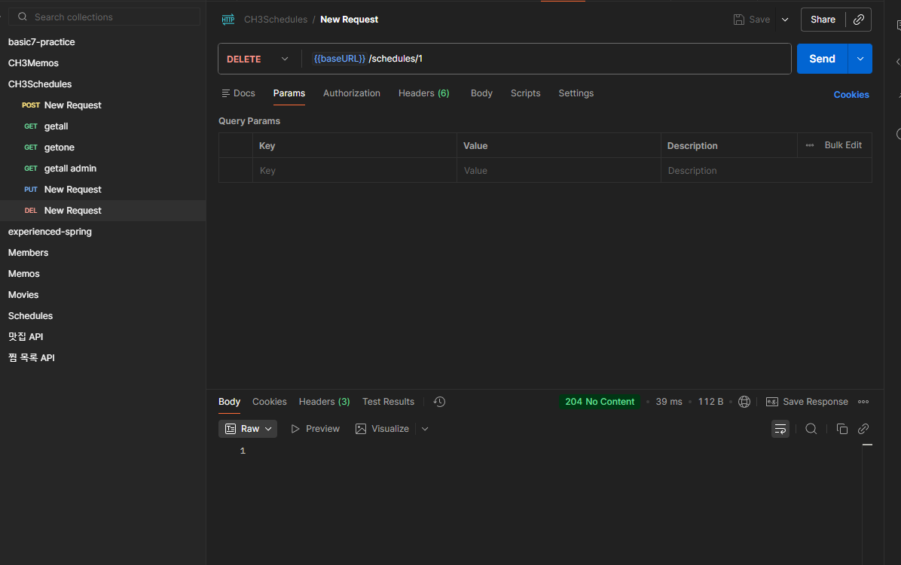

# Spring 일정 관리 앱 develop 과제

- 삭제의 경우 soft delete 로 구현하였음

=================================================================


## API 명세서

|    기능     | method |           url           |        request        |         response          | 상태코드 |
|:---------:|:------:|:-----------------------:|:---------------------:|:-------------------------:|:----:|
|   일정 생성   |  POST  |       /schedules        | ScheduleCreateRequest |  ScheduleCreateResponse   | 201  |
| 일정 조회 all |  GET   |       /schedules        |           -           | List<ScheduleGetResponse> | 200  |
| 일정 조회 one |  GET   | /schedules/{scheduleId} |      scheduleId       |    ScheduleGetResponse    | 200  |
|   일정 수정   |  PUT   | /schedules/{scheduleId} | ScheduleUpdateRequest |  ScheduleUpdateResponse   | 200  |
|   일정 삭제   |        | /schedules/{scheduleId} |      scheduleId       |                           | 204  |
|   유저 생성   |  POST  |         /users          |   UserCreateRequest   |    UserCreateResponse     | 201  |
| 유저 조회 all |  GET   |         /users          |           -           |   List<UserGetResponse>   | 200  |
| 유저 조회 one |  GET   |     /users/{userId}     |        userId         |      UserGetResponse      | 200  |
|   유저 수정   |  PUT   |     /users/{userId}     |   UserUpdateRequest   |    UserUpdateResponse     | 200  |
|   유저 삭제   |        |     /users/{userId}     |        userId         |             -             | 204  |


ScheduleCreateRequest -- json

```json
{
    "userName":"홍길동",
    "title": "제목",
    "content": "내용"
}
```

ScheduleCreateResponse -- json

```json
{
    "id": "1",
    "userName":"홍길동",
    "title": "제목",
    "content": "내용"
}
```

ScheduleGetResponse-- json

```json
{
    "id": "1",
    "userName":"홍길동",
    "title": "제목",
    "content": "내용",
    "createdAt": "~",
    "modifiedAt": "~"
}
```

ScheduleUpdateRequest -- json

```json
{
    "title": "수정제목",
    "content": "수정내용"
}
```


ScheduleUpdateResponse -- json

```json
{
    "id": "1",
    "userName":"홍길동",
    "title": "수정제목",
    "content": "수정내용"
}
```

UserCreateRequest -- json

```json
{
    "id": "1",
    "name":"홍길동",
    "email": "email@email.com"
}
```

UserCreateResponse -- json

```json
{
    "id": "1",
    "name":"홍길동",
    "email": "email@email.com",
    "createdAt": "~",
    "modifiedAt": "~"
}
```

UserGetResponse-- json

```json
{
    "id": "1",
    "name":"홍길동",
    "email": "email@email.com",
    "createdAt": "~",
    "modifiedAt": "~"
}
```

UserUpdateRequest-- json

```json
{
    "name":"수정된홍길동",
    "email": "iemail@email.com"
}
```

UserUpdateResponse-- json

```json
{
    "id": "1",
    "name":"수정된홍길동",
    "email": "iemail@email.com",
    "createdAt": "~",
    "modifiedAt": "~"
}
```

=================================================================

## ERD


```sql
CREATE TABLE user (

    id BIGINT PRIMARY KEY AUTO_INCREMENT,

    name VARCHAR(255) NOT NULL,

    email VARCHAR(255) NOT NULL,

    createdAt TIMESTAMP NOT NULL,

    modifiedAt TIMESTAMP NOT NULL

);

CREATE TABLE schedule (

    id BIGINT PRIMARY KEY AUTO_INCREMENT,

    user_id BIGINT NOT NULL,

    title VARCHAR(255),

    content VARCHAR(255),

    createdAt TIMESTAMP NOT NULL,

    modifiedAt TIMESTAMP NOT NULL,

    CONSTRAINT fk_schedule_user

    FOREIGN KEY (user_id)

    REFERENCES user(id)


)
```
